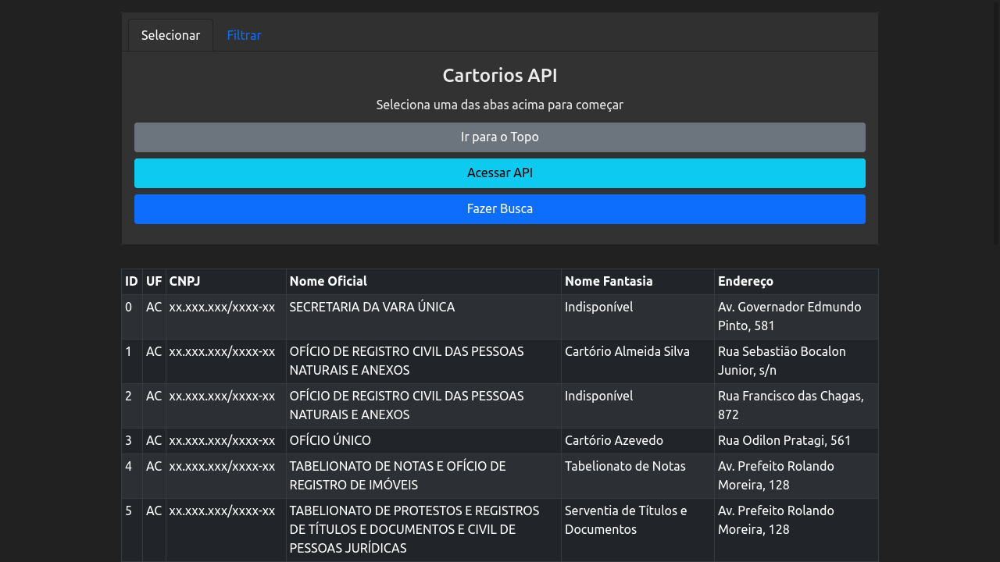
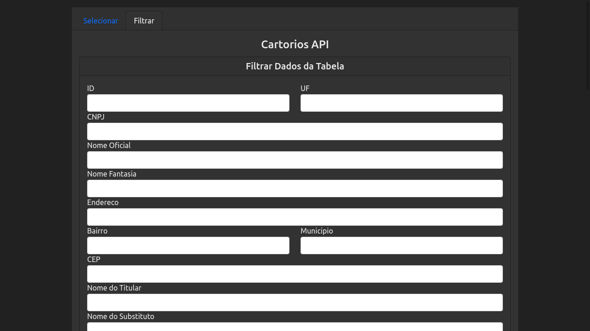
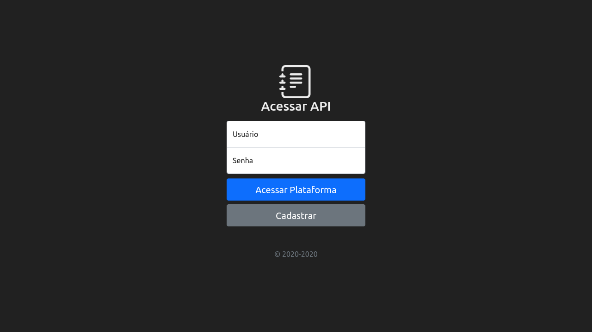
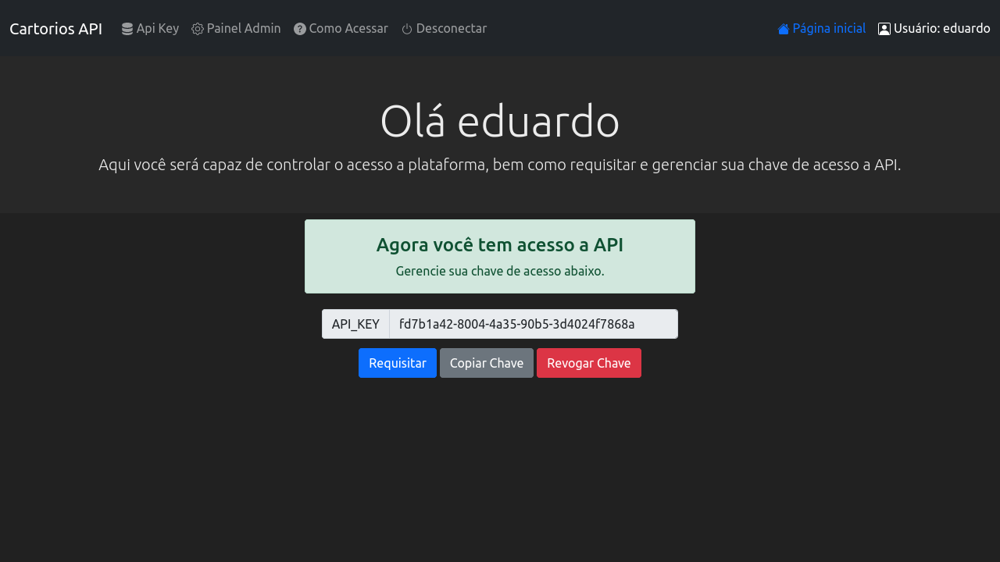
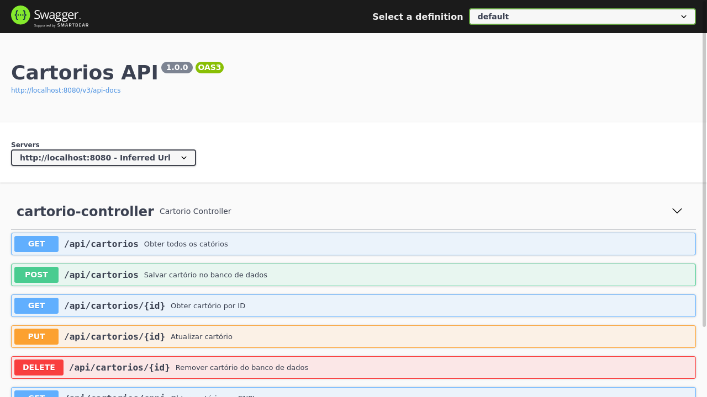

<br />
<p align="center">
  
  

  <h3 align="center">Cartorios-API Frontend</h3>
</p>

## Sobre

Nesse repositório se encontra a parte do projeto no qual:
1. Gera/Revoga Token API do usuário para acessar a API
2. Acessa os dados do banco utilizando uma interface interativa

### Desenvolvido com

* [Java 11](https://openjdk.java.net/)
* [Spring Boot](https://spring.io/)
* [PostgreSQL](https://www.postgresql.org/)
* [Thymeleaf](https://www.thymeleaf.org/)
* ...

### Pré-requisitos

1. Java 11
2. PostgreSQL

## Como Usar

* Criar tabelas do banco de dados  
  O arquivo `createDatabase.sql` se encontra na pasta `/database` do repositório
    ```shell
    psql -f /alguma/pasta/createDatabase.sql
    ```

    * Se já estiver conectado ao banco de dados
    ```postgresql
    \i /alguma/pasta/createDatabase.sql
    ```

* Iniciar aplicação
    ```shell
    ./gradlew bootRun
    ```

* Iniciar aplicação com argumentos
    ```shell
    ./gradlew bootRun --args='--spring.profiles.active=dev'
    ```

* Gerar .jar
    ```shell
    ./gradlew bootJar
    ```
  
## Exemplo






## License

Distributed under the MIT License. See `LICENSE` for more information.
