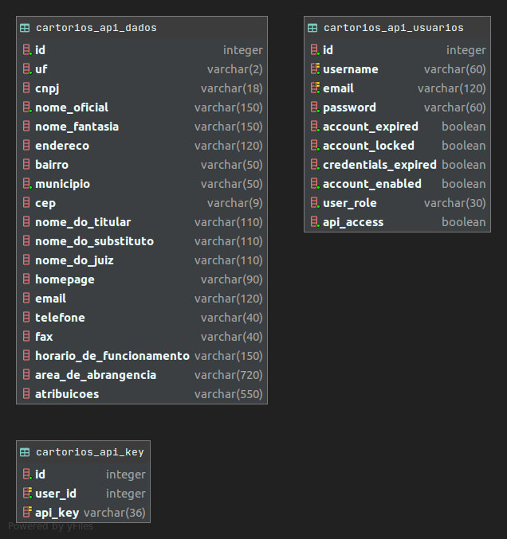

# Database



## Criar tabelas do banco de dados  
```shell
psql -f /alguma/pasta/createDatabase.sql
```

* Se já estiver conectado ao banco de dados
```postgresql
\i /alguma/pasta/createDatabase.sql
```